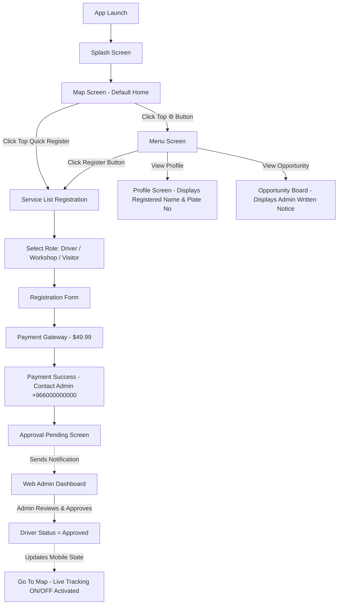

# 📱 DRIVER LIFE TRACKING SYSTEM - WIREFRAME & WORKFLOW PROGRESS DOCUMENT

---

## 🎨 1. WIREFRAME MAPPING SPECIFICATION

### 🗺️ Screen 1: Home Map Screen (`app/app/map.js`)
```
+-------------------------------------------------------------+
| [TRUCK] MAP                [👤 Register] [Driver Mode] [⚙️] |
+-------------------------------------------------------------+
|                                                             |
|           📍 Own Location                                   |
|                                🛠️ Workshop                   |
|                                                             |
|   🛢️ Oil Change                                             |
|                                📍 Car Location              |
|                                                             |
|  +-------------------------------------------------------+  |
|  | All Services are Visible to everyone                   |  |
|  | (Visitor Visible to himself only)                     |  |
|  +-------------------------------------------------------+  |
|                                                             |
|       +---------------------------------------------+       |
|       | Life Tracking     [ (o) ON ]     ON         |       |
|       +---------------------------------------------+       |
+-------------------------------------------------------------+
```
- **Key Elements**:
  - Direct open on launch (Splash ➔ Map).
  - Quick `[👤 Register]` button on top bar.
  - Driver & Visitor mode view toggle.
  - `Life Tracking ON/OFF` floating switch box.
  - Top-right `⚙️` Settings button to open Menu.

---

### ☰ Screen 2: Menu Navigation Screen (`app/app/menu.js`)
```
+-------------------------------------------------------------+
| < Menu Settings                                             |
+-------------------------------------------------------------+
|  MAP                                                      > |
|  Profile                                                  > |
|  Opportunity                                              > |
|  Notification                                             > |
|  Contact us                                               > |
|  Setting                                                  > |
|  Dark-Light Mod                                    [ 🌙 ]   |
+-------------------------------------------------------------+
|  [         REGISTER (OPEN SERVICE LIST) BUTTON            ] |
|  [              LANGUAGE: ENGLISH BUTTON                  ] |
+-------------------------------------------------------------+
```
- **Key Elements**:
  - Exact 7 menu list items.
  - Direct `Register (open Service List)` primary button.
  - Language toggle button (English/Arabic).

---

### 📝 Screen 3: Service List Registration (`app/app/register/index.js`)
```
+-------------------------------------------------------------+
| < Service List Registration                                 |
+-------------------------------------------------------------+
|  Select Service / Role                                      |
|                                                             |
|  Driver (Life Tracking)                                [  ] |
|  Workshop (Location only)                              [  ] |
|  Oil change (Location only)                            [  ] |
|  Car Location (Location only)                          [  ] |
|                                                             |
|  +-------------------------------------------------------+  |
|  | Visitor                                          [  ] |  |
|  | (it is upto Admin to be required or no)               |  |
|  +-------------------------------------------------------+  |
+-------------------------------------------------------------+
```
- **Key Elements**:
  - Role selection cards with selection indicator checkboxes.
  - Special Visitor role card with admin requirement note.

---

### 📋 Screen 4: Driver Registration Form (`app/app/register/form.js`)
```
+-------------------------------------------------------------+
| < Driver Registration                                       |
+-------------------------------------------------------------+
|  Name                                                       |
|  [ Enter Name                                             ] |
|                                                             |
|  Last Name                                                  |
|  [ Enter Last Name                                        ] |
|                                                             |
|  Mobile NO                                                  |
|  [ Enter Mobile Number                                    ] |
|                                                             |
|  For driver Car plate number                                |
|  [ Enter Car Plate Number                                 ] |
|                                                             |
|  Email Option                                               |
|  [ Enter Email Address                                    ] |
|                                                             |
|  Track Location                                   [ (o) ON ] |
|  Accept Terms & Condition                         [ (o) ON ] |
|                                                             |
|  [                       NEXT BUTTON                      ] |
+-------------------------------------------------------------+
```
- **Key Elements**:
  - Clean input fields with zero pre-filled auto-fill.
  - `KeyboardAvoidingView` to prevent keyboard overlap on iOS/Android.

---

### 💳 Screen 5: Payment & Contact Admin (`app/app/register/success.js`)
```
+-------------------------------------------------------------+
| For Approval Contact Us                                     |
+-------------------------------------------------------------+
|                           ( ✓ )                             |
|                  Payment Gateway Success                    |
|                                                             |
|  +-------------------------------------------------------+  |
|  | For Approval Contact Us                                |  |
|  | +966000000000                                         |  |
|  | Contact admin via WhatsApp or Phone call for account  |  |
|  | activation.                                           |  |
|  +-------------------------------------------------------+  |
|                                                             |
|  [ 💬 Contact via WhatsApp                                ] |
|  [ 📞 Call Admin Direct (+966000000000)                   ] |
|  [ Proceed to Approval Status                             ] |
+-------------------------------------------------------------+
```
- **Key Elements**:
  - Payment setup fee ($49.99) completion summary.
  - Direct WhatsApp (`wa.me/966000000000`) & Phone Call triggers.

---

### ⏳ Screen 6: Approval Pending Status (`app/app/register/pending.js`)
```
+-------------------------------------------------------------+
| Approval Status                                             |
+-------------------------------------------------------------+
|                           ( 🕒 )                            |
|                 Waiting For Admin Approval                  |
|                                                             |
|  Your payment & registration request has been sent to       |
|  Admin Dashboard. Please wait for admin approval.           |
|                                                             |
|  Current Status: [ Approval Pending ]                       |
|                                                             |
|  [ ⚡ Simulate Admin Dashboard Approval                   ] |
|  [ Go To Map (Pending Mode / Approved Mode)               ] |
+-------------------------------------------------------------+
```
- **Key Elements**:
  - Live state trigger: Pending ➔ Approved.
  - Approval unlocks Driver Live Tracking ON/OFF switch on Map.

---

## 🔄 2. COMPLETE WORKFLOW PROGRESS & CONNECTIVITY



---

## 📊 3. IMPLEMENTATION STATUS CHECKLIST

| Module | Feature / Component | Status | Code Location |
|---|---|---|---|
| **Mobile** | Splash Direct to Map | ✅ Completed | `app/app/index.js` ➔ `map.js` |
| **Mobile** | Map Live Telemetry & Markers | ✅ Completed | `app/app/map.js` |
| **Mobile** | Life Tracking ON/OFF Switch Box | ✅ Completed | `app/app/map.js` |
| **Mobile** | Quick Register & Top Bar Buttons | ✅ Completed | `app/app/map.js` |
| **Mobile** | Menu Navigation & Item List | ✅ Completed | `app/app/menu.js` |
| **Mobile** | Service List Role Selector | ✅ Completed | `app/app/register/index.js` |
| **Mobile** | Registration Form & Keyboard Avoid | ✅ Completed | `app/app/register/form.js` |
| **Mobile** | Payment Gateway & Contact Admin | ✅ Completed | `app/app/register/payment.js`, `success.js` |
| **Mobile** | Approval Pending & Approved Trigger | ✅ Completed | `app/app/register/pending.js` |
| **Mobile** | Dynamic Profile Screen | ✅ Completed | `app/app/profile.js` |
| **Mobile** | Dynamic Opportunity Notice Board | ✅ Completed | `app/app/opportunity.js` |
| **Web** | Responsive Layout & Sidebar | ✅ Completed | `web/src/components/common/layout/` |
| **Web** | Driver Requests & Approval Modal | ✅ Completed | `web/src/pages/Drivers/Drivers.jsx` |
| **Web** | Services & GPS Lat/Lng Manager | ✅ Completed | `web/src/pages/Services/Services.jsx` |
| **Web** | Opportunity Notice Writer | ✅ Completed | `web/src/pages/Opportunity/Opportunity.jsx` |
| **Web** | Payments Audit Log | ✅ Completed | `web/src/pages/Payments/Payments.jsx` |

---

*Repository Remote Sync*: All features pushed and verified on `origin/main` (`https://github.com/divyansh-connect/New-Transport-Ui.git`).
