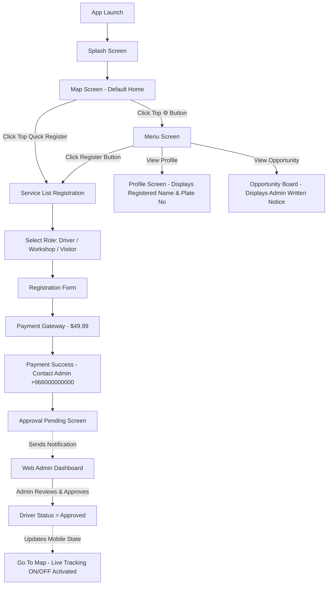

# 🔄 WORKFLOW SPECIFICATION DOCUMENT

## 🚀 End-to-End System Integration Flow

---

## 📱 Mobile App ↔ 💻 Web Admin Dashboard Data Interconnection

1. **Driver Registration & Approval**:
   - **Mobile**: Driver fills form (`Name`, `Mobile`, `Car Plate Number`) & pays $49.99.
   - **Web**: Admin receives alert on **Driver Requests (`Drivers.jsx`)**, views details, and clicks **`Approve`**.
   - **Mobile**: Driver screen updates status to **`Approved`**, enabling **Life Tracking ON/OFF** switch on Map.

2. **Registered Profile Sync**:
   - **Mobile**: Driver profile details (`app/app/profile.js`) automatically show the registered driver's name and plate number instead of static placeholders. Unregistered visitors see "Unregistered Visitor" with a "Register Now" trigger.

3. **Services & GPS Coordinates Sync**:
   - **Web**: Admin manages Workshops, Oil Stations & Car Locations with Latitude/Longitude input fields in **Services (`Services.jsx`)**.
   - **Mobile**: Locations automatically populate as service pins (`🛠️`, `🛢️`, `📍`) on the Driver Map.

4. **Opportunity Notice Board Sync**:
   - **Web**: Admin writes announcements in **Opportunity (`Opportunity.jsx`)**.
   - **Mobile**: Drivers view published notices inside **Menu ➔ Opportunity (`opportunity.js`)**.
